# Version control with RStudio

<hr class="double">

## Introduction

Version control is a really powerful tool in a researcher's toolkit, but also one of the most intimidating. Using git directly through a terminal interface (inside or outside of RStudio) requires learning a new language (git) which can be really off-putting, but newer versions of RStudio have an in-built git interface to make this much more user-friendly.

This guide will serve as a brief introduction to setting up version control with RStudio for new or existing projects without needing to use the terminal.

<hr class="double">

## Requirements

The minimum technical requirements:

+  RStudio v1.1.383 or later
+  Mac users:
    +  [Install git](http://git-scm.com/downloads) 
+  Windows users:
    +  [Install git and  Git BASH](https://gitforwindows.org/)
    +  Windows doesn't have a terminal by default. Git BASH serves as a terminal emulator.
  
<hr class="double">

## RStudio options

By default, RStudio does not assume a user has a git installation. It also does not always automatically register that one has been installed so the connection must be made.

Open RStudio's *Global Options* menu by going to **Tools > Global Options**. Under the *Git/SVN* tab you need to tick the *Enable version control interface for RStudio projects* box, and set the file path to your installed git executable.

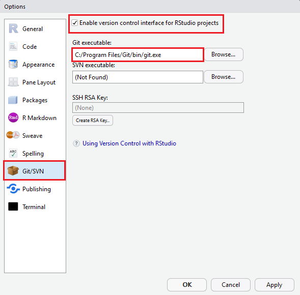
***

<hr class="double">

## RStudio Projects

Version control in RStudio require you to be using *Projects*. On top of version control, *Projects* improve the RStudio experience in other ways and you should be using them anyway...

To create a *Project* you can either go to **File > New Project**:

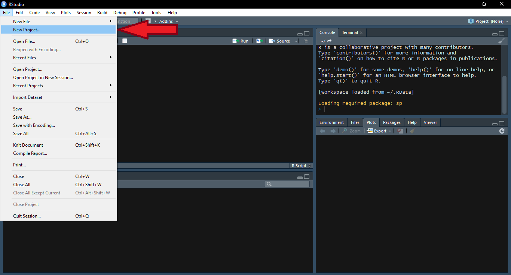
***

Or use the project menu in the top-right corner:

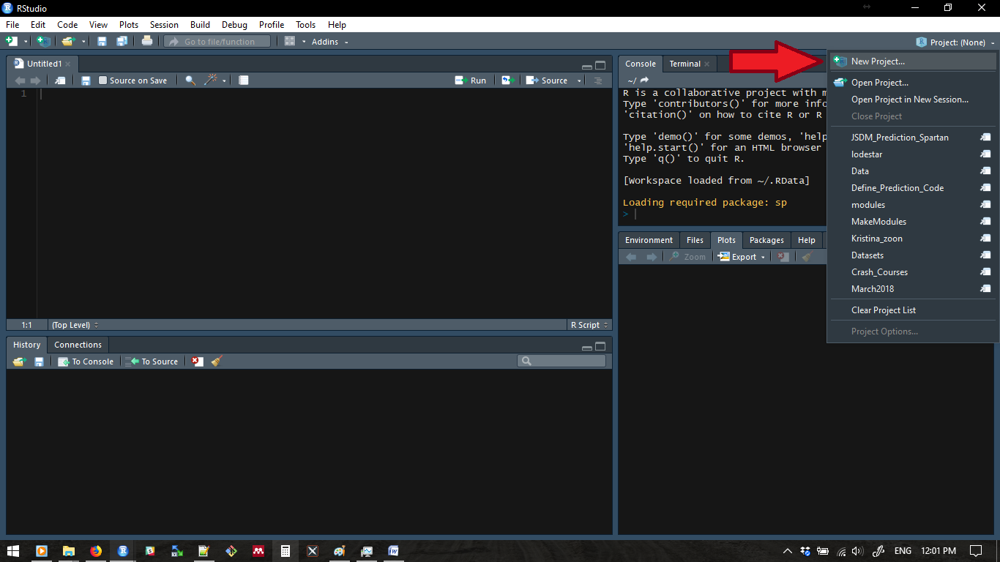
***

The *New Project* menu has three options: New Directory, Existing Directory, and Version Control. Each of these follow a different process.

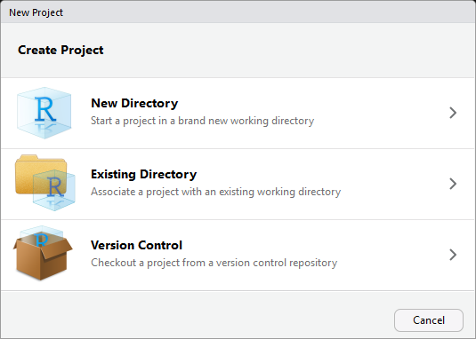
***

<hr class="small">

### New Directory

The new directory option is for when you're starting from scratch. First, select *New Project* from the *Project Type* menu.

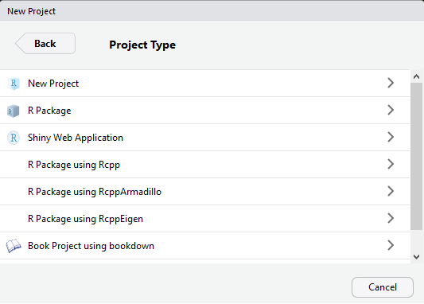
***

Now give your project a name, set where you want it to be a subdirectory, and tick the *Create a git repository* box.

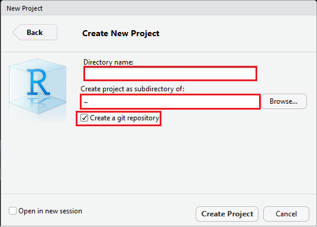
***

This creates the project, creates a directory for it, and does all of the leg work setting up a local git repository for the project.

<hr class="small">

### Existing Directory

The existing directory option is for adding version control to an existing directory. The first thing to do is select the directory you want to turn into a project.

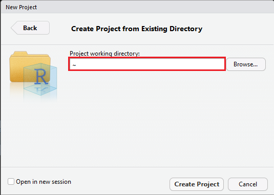
***

You can't set up a project in an existing directory *and* set up version control at the same time. This means that we need to manually set up version control after creating the project. Got to **Tools > Version Control > Project Setup...**.

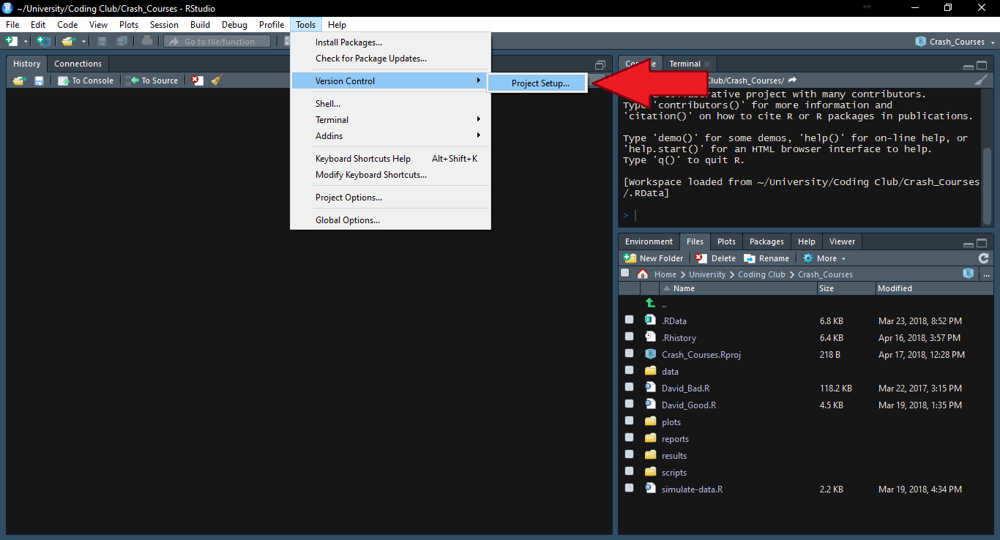
***

Now set the *Version control system* to Git.

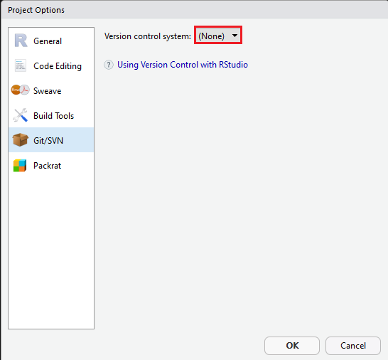
***

And now you can initialise a git repository for the project.

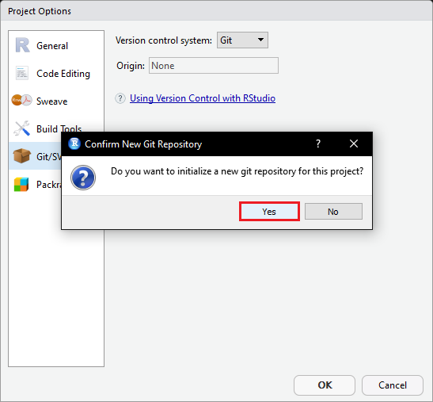
***

<hr class="small">

### Create a local version of an online repository

The final *Project* option, *Version Control*, is to create a project on your local machine that is a *clone* of an online git repository. The two most common uses for this option are 1) collaboration, and 2) you've created the repository on GitHub first.

The first thing you need to do is select which version control system you are using (Git in our case).

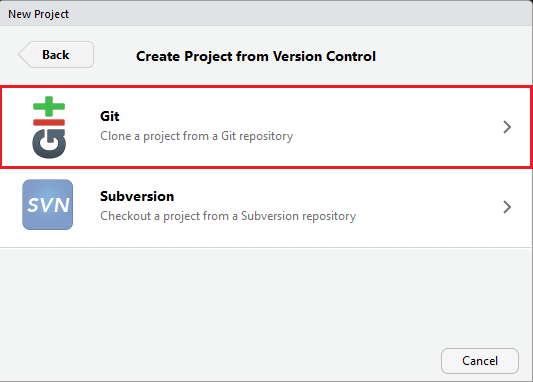
***

Now you need to provide the URL for the repository you want to clone, set the name of the directory for your local version, and select where it will be a subdirectory of. The *test_git_repo* GitHub repository is one I set up for this guide, so feel free to clone it yourself (just change your directory path!).

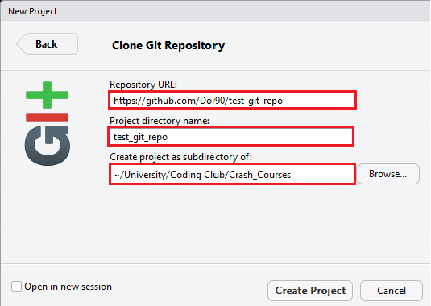
***

<hr class="double">

## RStudio's Git Interface

RStudio provides a Git interface that is a) only visible after you set up a version controlled project, and most importantly b) less intimidating that the terminal. Almost everything can now be done by point-and-click. A Git menu shows up in the toolbar at the top of the screen, but it is easier to keep everything in the Git pane.

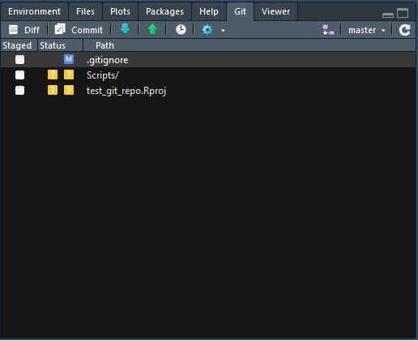
***

The first thing you will notice is a list of files in your directory and some coloured squares. The most important thing to know is that these are not necessarily *all* of your files, but just those that have *changed* since the last Git "save state" (more on that to come).

This is where you *stage* your files to be *committed* (saved) later. The *Status* column gives you coloured indicators about what has happened to the file since the last *commit*:

+  **Blue**: Modified (M) files. These files have *changed* since the alst *commit*.
+  **Yellow**: Untracked (?) files. Git has not yet been told you track changes in these files. These are usually new files.
+  **Green**: Added (A) files. These are files that have been created since the last commit. Most **Yellow** files turn **Green** when they are *staged* (i.e. Git now knows to track their changes)
+  **Red**:  Deleted (D) files. These files have been deleted since the last commit.

The *Status* column itself has two columns of these coloured icons. The left column is for *staged* files and the right column is for *unstaged* files. Untracked (yellow) files show up in both columns.

<hr class="small">

### Staging Files

You might not always want to commit to the changes you've made in *all* of your files. This is what the *staging area* is for. You *stage* the files you want to commit by clicking the appropriate tick box. Thse files are now ready to be *committed*.

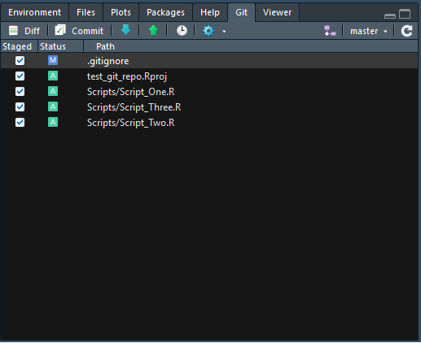
***

<hr class="small">

### Committing

You *commit* files to generate a "save state" or "backup point". After *staging* your files you can click the *Commit* button in the Git pane to open the a new window and proceed.

This new windows has three panes:

+  *Staging Area*: The same as seen in the Git pane
+  *Commit Message*: You can add a commit message to each of your commits by adding text here. There are no set rules for what to put in a commit message, but something useful helps for tracking things down later. E.g. "Added file X", "New version of files Y & Z. Fixed model fitting bug".
+  *Differences*: This pane shows you the differences in a file (whichever one is selected in the *Staging Area* pane) between the last commit and this pending one. Lines in *green* have been added, and lines in *red* removed. Changed lines will show up with both a *green* and *red* line.

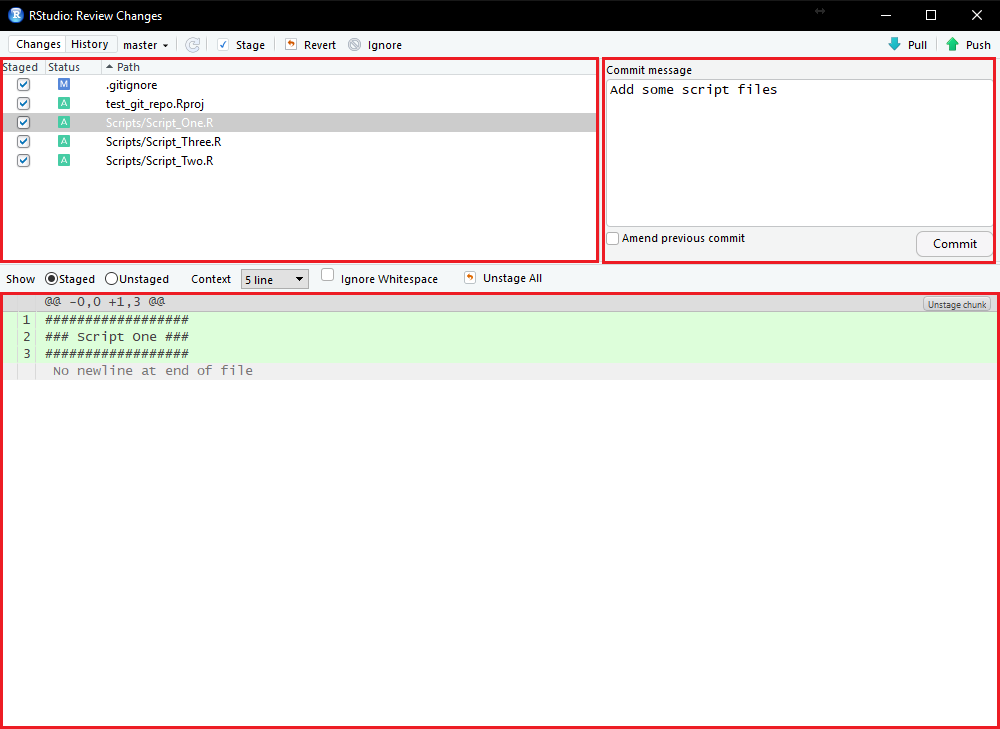
***

When you have *staged* everything you want to *commit* and suppied a commit message you can then click *Commit* in the *Commit Message* pane. This will pop up a terminal window but you can ignore it if you wish. It will provide a summary of the commit, or show an error is someting went wrong. In this case, we changed 5 files which involved inserting a total of 23 new lines and creating four new files.

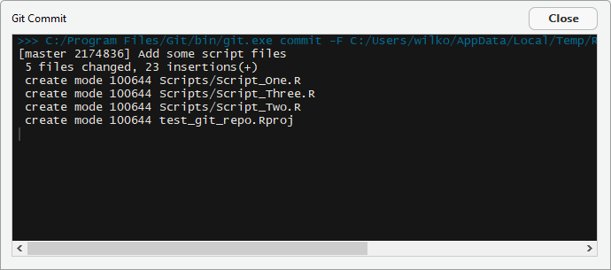
***

If you are running with a local and online version of the repository then your Git pane will now show a message detailing how out of synch they are.

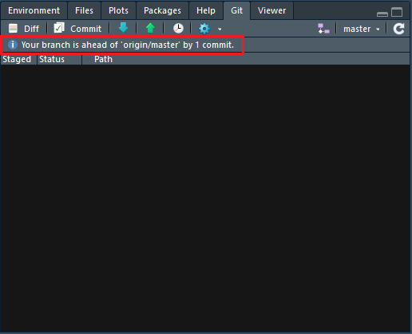
***

<hr class="small">

### Push/Pull

If you are just using Git locally then you can ignore this section. If you are working with online repositories you will need to learn how to *push* and *pull*. The difference between the two is that you *push* your local changes to the online repository, and you *pull* changes on the online repository to your local version. You will only need *pull* if you are collaborating with other people or manually change the online files on GitHub.

If we are ahead of the online repository because we have committed something new then a notification pops up in the Git pane.


***

If we want to send our changes to the online repository then we need to be linked together. If you have created your *project* by cloning an online repository then this link is already in place, but if you created only a local repository using a new or existing repository then the link need to be created manually. So far this guide has done everything within RStudio's Git interface, but setting up these links between local and remote (i.e. GitHub) repositories can't be done with buttons. This means we need to use the terminal!

You only need to run one command in the terminal and then you can run back to the safety of RStudio. The command is as follows, and you just replace <Account> and <Repository> with the account and repository ID of the GitHub repository:

```{}
git remote add origin https://github.com/<Account>/<Repository>.git
```

For example:

```{}
git remote add origin https://github.com/Doi90/test_git_repo.git
```

Now that the link is established you can *push* your changes to the online repository by cliking the *push* button (green up arrow) in the Git pane. Thsi will open a new window showing some Git messages you can ignore.

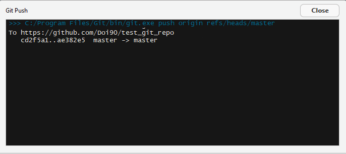
***

If you need to *pull* changes then you just use the *pull* button (blue down arrow).

<hr class="double">