# Introduction to Spartan

(\#label:IntroToSpartan)

## What is Spartan?

***
<center></center>

***

Spartan is the University of Melbourne's high performance computing system (HPC). It is designed to suit the needs of researchers whose desktop/laptop is not up to the particular task. Models running slow, datasets are too big, not enough cores, application licensing issues, etc.

Spartan consists of:

*  a management node for system administrators,
*  two log in nodes for users to connect to the system and submit jobs,
*  'bare metal' compute nodes, and
*  GPUGPU compute nodes.

## Accessing Spartan

### Getting an Account

To gain access to Spartan you need to create an account.

*  Via Karaage at [link](https://dashboard.hpc.unimelb.edu.au/karaage)
*  Need to create a project
+  Need a project leader (you), and you can invite collaborators for joint projects
+  Need a project title/description to demonstrate research goals and/or research support 
*  Takes ~2 days for approval (as of 2017)

***
<center>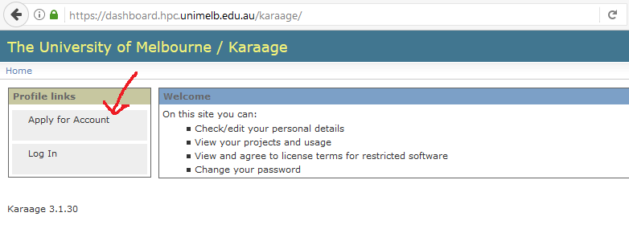</center>

***

### Required Programs

To connect to Spartan you will need a Secure Shell (SSH) and a Secure File Transfer Protocol (SFTP) client. The SSH client is your interface with Spartan while the SFTP client is used to transfer files from your local computer to your Spartan home directory.

#### Windows Users

Use PuTTY as your SSH client. This is an easy set-up with the following five steps:

1.  Set your host name: spartan.hpc.unimelb.edu.au
2.  Set your port number: leave as default (whereas Boab users need a defined port)
3.  Set your connection type: SSH
4.  Name your session to make it easy for future log-ins: Whatever you like i.e. Spartan
5.  Save your session details

***
<center>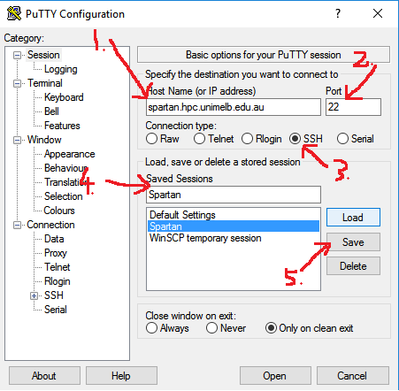</center>

***

Your first log-in to Spartan via the SSH client creates your home directory on Spartan so it is important to do that before setting up your SFTP client.

Use WinSCP as your SFTP client. This is an easy process with the following six steps:

1.  Set your file protocol: SFTP
2.  Set your host name: spartan.hpc.unimelb.edu.au
3.  Set your port number: leave as default (whereas Boab users need a defined port)
4.  Enter your username
5.  Enter your password (note, this will show more characters than you entered when saved)
6.  Log-in

***
<center></center>

***
Inside a WinSCP session you will have dual file explorer windows: your local machine (left) and Spartan (right). If you have not made your initial log-in to Spartan via your SSH client you will have a blank white screen in the right-hand window. Transferring files between the two directories is achieved with a simple drag-and-drop interface.

***
<center>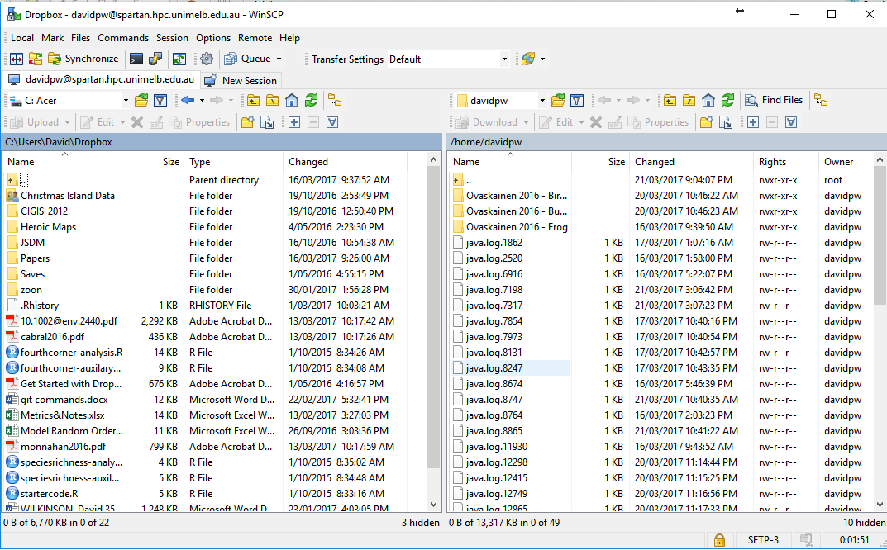</center>

***

Your two clients are now set up and everything is ready to access Spartan. After set-up you don't need to deal directly with PuTTY as a separate program anymore as there is a button in the WinSCP toolbar to open a session.

***
<center></center>

***

#### Mac/Linux Users

Unlike for Windows, OSX and (most) linux operating systems already have SSH installed and have a fully functional terminal built in.
So to SSH into the Spartan log-in node, you just need to open up a terminal (the `Terminal` application on a mac), and issue the command:

```{}
ssh myusername@spartan.hpc.unimelb.edu.au
```

Replacing `myusername` with your username. Then enter your password (no characters will show, that's normal) and hit return. That should look something like this:

***
<center>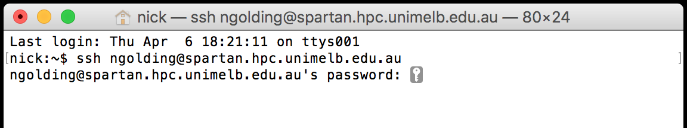</center>

***

Same as for Windows, your first log-in to Spartan via the SSH client creates your home directory on Spartan so it is important to do that before setting up your SFTP client.

SFTP is also installed on most OSX and linux versions, so you could transfer files to Spartan directly from the terminal (do `man sftp` in the terminal if you're interested in that). However it's normally easier to use a SFTP client with a graphical user interface. One nice option for OSX (that also works on Windows) is [Cyberduck](https://cyberduck.io). Once installed, you can add a new connection to Spartan with the following steps:

1.  Clicking on the `+` in the lower-left corner
2.  Set the connection type to SFTP
3.  Give the connection a name
4.  Set the server name: `spartan.hpc.unimelb.edu.au`
5.  Set the port number to 22
6.  Enter your username

***
<center>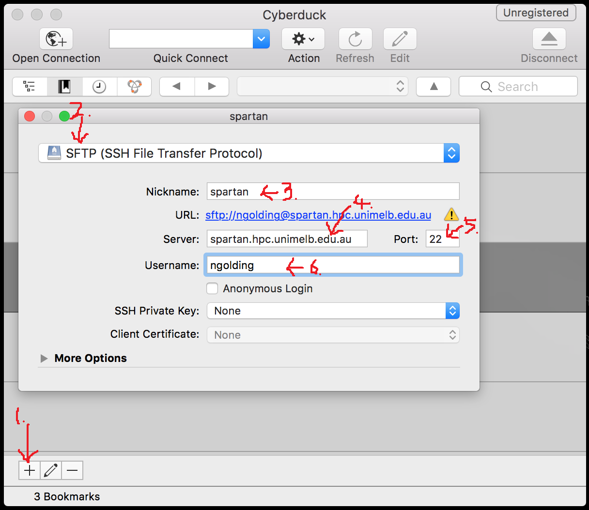</center>

***

You can then close the connection details box, and double-click on the new connection to initiate it. This will pop up a file explorer like the image below, listing the files in your working directory on Spartan. You can drag and drop files between there and your computer.

***
<center>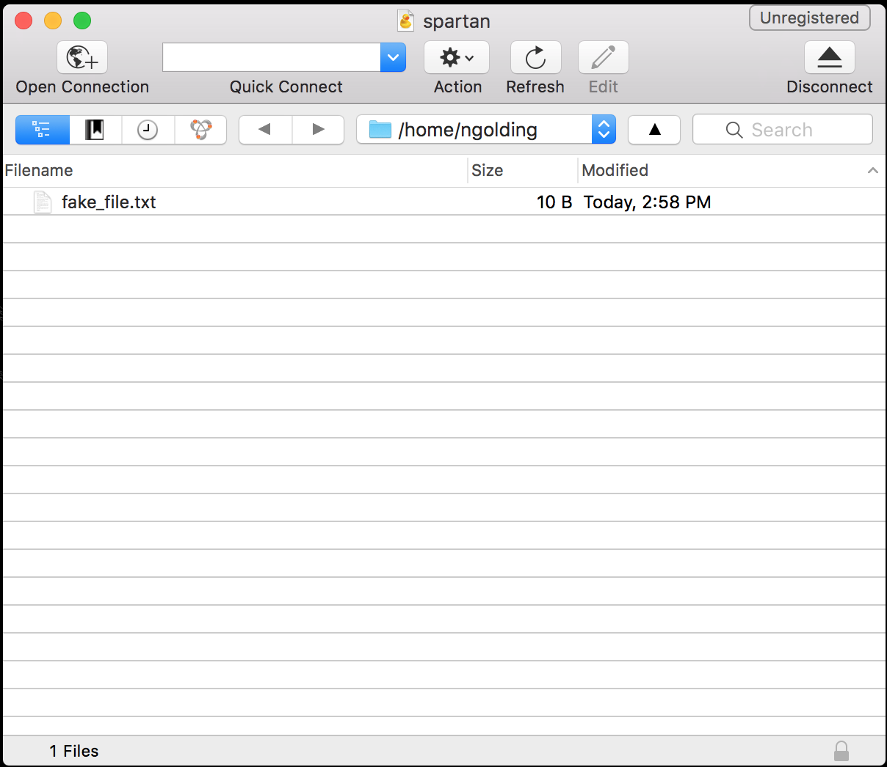</center>

***

### Log in to Spartan

Now that you have everything in place to access Spartan, open an SSH session (in PuTTY or Terminal). As before, this wont display characters as you type your password.

***
<center>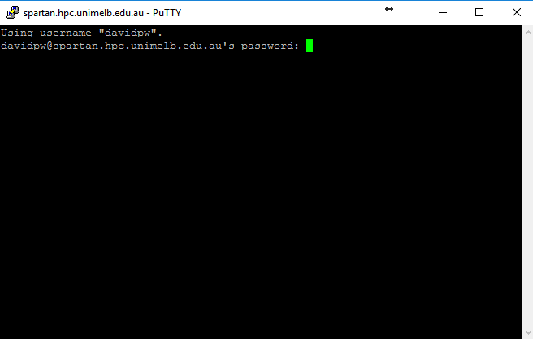</center>

***

The text that loads at the beginning gives you the usual university IT policy spiel, a couple of getting started prompts, a warning about the log-in node, and the obligatory 300 reference. It also has a *Daily Weather Report* updated each morning to show how busy Spartan is. As it is only updated once a day though it is only a rough indication and can vary wildly if lots of jobs start or finish.

***
<center>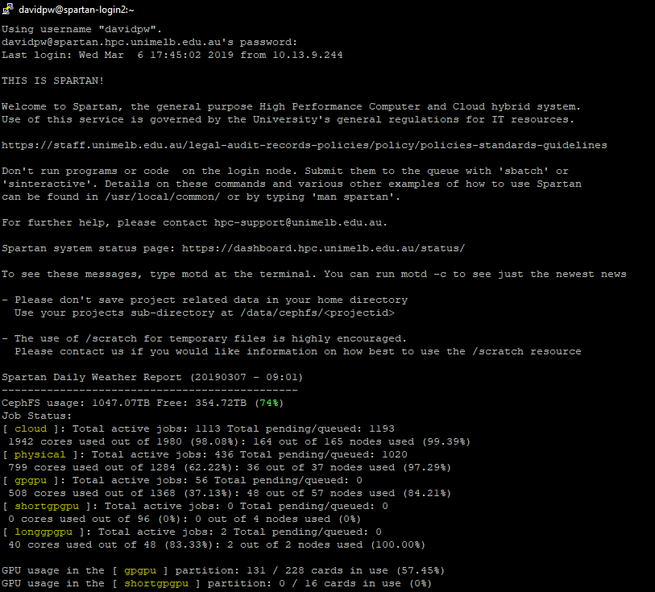</center>

***

### Help

Typing `man Spartan` loads the university's Spartan FAQ. Rather than loading the entire document it loads it a screen at a time and you have to navigate by keyboard commands. For now, you will only need these:

*  `h`: help, shows you the keyboard shortcuts
*  `q`: quit the document and go back to the Spartan interface
*  `^` is shorthand for the control/command button, so `^V` is Ctrl+V / Cmd+V
*  `Enter/Return` will let you advance by one line
*  `^Y` will let you go back by one line
*  `^V` will let you advance by one window
*  `^B` will let you go back by one window

***
<center>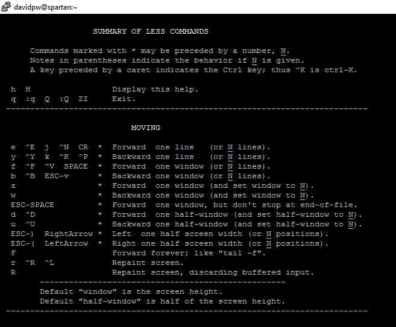</center>

***

If you want help with a particular function in Spartan you can type `man <function name>` (without < >). This works like `?` in R.

## Using Spartan

The log-in nodes on Spartan are a shared resource between all users and is only allocated the memory to handle log-ins and job submission. **Do not run jobs in the log-in node or the admins will get upset and kill the job**. There are two ways to get out of the log-in node and into dedicated compute nodes: `sinteractive` and `sbatch`.

### sinteractive

The `sinteractive` command will give you access to a compute node (as soon as available) where you can work interactively with your job. While you can submit an entire job in this method, that is better saved for `sbatch` while `sinteractive` is used for testing/debugging. There are default settings for `sinteractive` which should be enough for most uses, but they can be modified if needed like so:

```{}
sinteractive --time=00:10:00 --nodes=1 --ntasks=1 --cpus-per-task=2
```

This will give you access to one node to perform one task with two processors for ten minutes (the default values). Lets open a default node and explore some basic commands. Type `sinteractive`. This submits a request for a default compute node (1), and you have to wait for the resource to become available (2) before you can continue.

***
<center></center>

***

The `ls` command will show you everything in your current directory. Folders show up in blue.

***
<center>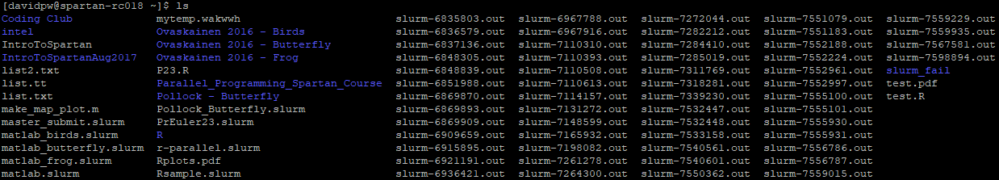</center>

***

The `cd` command will let you change your current directory. As Spartan is Linux based it uses / not \\ for directories (unlike Windows). The \\ character is used to say that the preceding term is a special character. Lets change into a sub-folder and see what is inside. Spartan lets you pre-fill filepaths/names using the tab key like R but slightly differently. It will pre-fill everything until a choice needs to be made and then pressing the tab key twice will list some options. Once only one exist then it will finish the autocomplete.

The `pwd` command prints your current working directory. Lets run a sequence of `pwd`, `cd`, and `ls` to see them in action.

***
<center>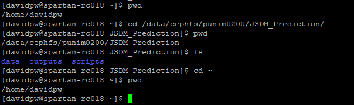</center>

***

The programs available on Spartan as referred to as modules, and you can see a complete list using `module avail`.

***
<center></center>

***

A massive list of all modules isn't that useful! We can return more targetted lists either by adding a keyword to `module avail` or by using `module spider`. `module avail` searches for the keyword in the "full" module name so something like `module avail r` will return every module with the letter *r* in it so use something more specific like `module avail r/3.6` instead to return all versions of the R module that are version 3.6.*. `module spider` is a fuzzy match to the "actual" name of the module so `module spider r` will return all modules that are the closest match to the keyword, and a list of other module "actual" names that might also match.

***
<center>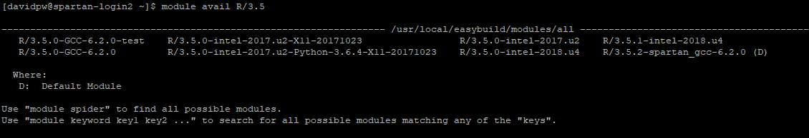</center>

***
<center>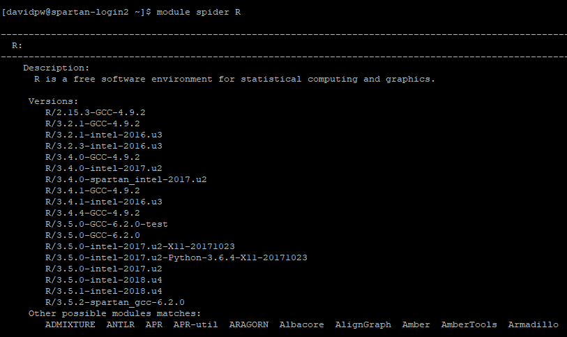</center>

***

There are two steps to loading a particular module. First, the `module load <module>` command to load the module into the compute node's environment, and then `<module name>` to start the program. If you don't specify the specific module version in `module load <module>` then it will load whichever version is set as the default (typically the newest one). For a variety of reasons it is best to always load a specific version! To load R for example:

***
<center>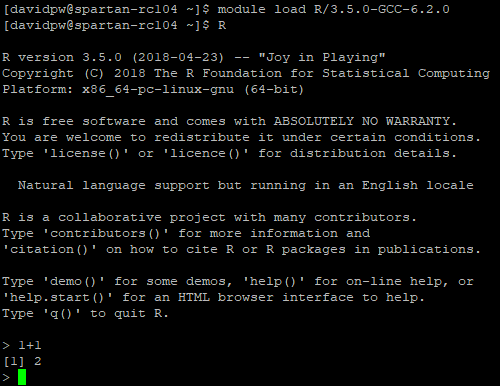</center>

***

### sbatch

The `sbatch` command is used for direct job submission to Spartan using the batch system called SLURM (Simple Linux Utility for Resource Management). 

***
<center></center>

***

This system tracks resources throughout the cluster and manages a queue of jobs. When resources are available the job scheduler will direct your job to a compute node to run.

***
<center>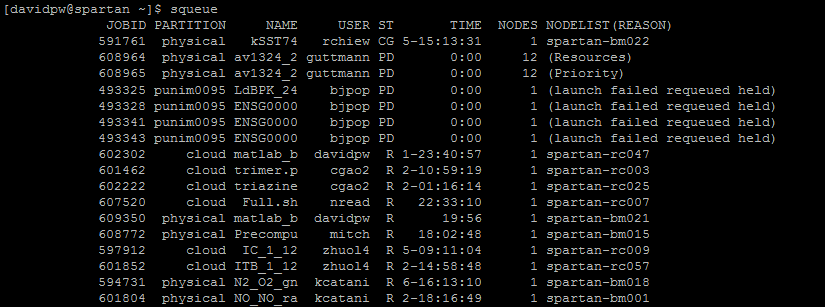</center>

***

To submit a job using the `sbatch` command you need to write a `slurm` script that sets up your instance (amount of memory, number of processors, etc) and runs your model. Note for Windows users: write these in Notepad++ as Windows and Linux use different line break notation (/r/n vs /n) and standard text files written on Windows won't run on Spartan. A basic `slurm` file for R might look like this (from Spartan's own examples):

```{bash eval = FALSE}
#!/bin/bash

# To give your job a name, replace "MyJob" with an appropriate name
#SBATCH --job-name=Rsample
#SBATCH -p physical

# For R need to run on single CPU
#SBATCH --ntasks=1

# set your minimum acceptable walltime=hours:minutes:seconds
#SBATCH -t 0:15:00

# Specify your email address to be notified of progress.
#SBATCH --mail-user=youreamiladdress@unimelb.edu
#SBATCH --mail-type=ALL

# Load the environment variables for R
module load r/3.6.0 

# The command to actually run the job
R --vanilla < tutorial.R 
```

`slurm` scripts can be as simple or as complex as required depending on the job you want to run. `slurm` scripts always need to begin with `#!/bin/bash` on the first line. Why? It tells the shell what kind of interpretor to run (in this case `bash`). Like `R`, anything following a `#` in `bash`/`slurm` is interpreted as a comment. However, `#SBATCH` is recognised as special syntax to control job parameters. You can mix commented lines, `#SBATCH` lines, and empty lines at the start of your script, but once the first "actual command" is run all subsequent `#SBATCH` lines are treated as comments only. Some useful `#SBATCH` commands to consider are:

*  `#SBATCH --job-name=<name>`: Lets you give your job a name alongside its job id. Useful if you're running lots of jobs at once. By default it sets it to your file name, or replace <name> with your name of choice like this:

```{}
#SBATCH --job-name=MyJob
```

*  `#SBATCH -p <partition>`: This is where you select which partition on Spartan your job will run. By default you only have acces to the `physical` partition which can run single or multi-node jobs of up to 72CPUS and 1500GB of memory (although getting access to that amount of resources in a single job will take time). There are also other specialty partitions with larger requirements or GPUs as well. If you have access to a dedicated partition then use `your partition name`. In most cases you will use the following:

```{}
#SBATCH -p physical
```

*  `#SBATCH --time=<>`: As Spartan is a communal resource and jobs are allocated a share from a queue you need to specify a maximum amount of walltime that you want your instance to remain open. As you aren't likely to know how long your model will need to run for (outside of a rough guess) it is recommended that you give a conservative estimate. If necessary you can contact Spartan support and get your time extended. There are multiple formats for entering a time value depending on the scale of your job: "minutes", "minutes:seconds",  "hours:minutes:seconds", "days-hours", "days-hours:minutes" and "days-hours:minutes:seconds". Many SLURM documentations will list setting `--time=0` as a way to set an indefinite walltime but this will automatically be rejected by Spartan. For example, a one hour instance could be called with the following:

```{}
#SBATCH --time=01:00:00   # hours:minutes:seconds format
```

*  `#SBATCH --nodes=<number>`: You need to request an allocation of compute nodes. Most jobs will be single node jobs, but there is the ability to run jobs over multiple nodes that talk to each other. Multi-node jobs will require using `OpenMPI` to allow the different nodes to communicate. To call a single node use the following:

```{}
#SBATCH --nodes=1
```

*  `#SBATCH --ntasks=<number>`: This line informs the SLURM controller that job steps within the allocation will launch a maximum of *number* tasks and to provide sufficient resources. Most jobs will need to a perform a single task which can be set as follows:

```{}
#SBATCH --ntasks=1
```

*  `#SBATCH --cpus-per-task=<number>`: This informs the SLURM controller that each task will need *number* of processors per task. To allocate four processors (like on a quad-core desktop without multi-threading) you would set:

```{}
#SBATCH --cpus-per-task=4
```

*  `#SBATCH --mem=<number>`: This is where you nominate the maximum amount of memory required per node (in megabytes). Physical nodes can have up to 1500GB. To request 10GB of memory (remembering that 1GB = 1024MB) you would use:

```{}
#SBATCH --mem=10240
```

*  `#SBATCH --mail`: The final group of useful `sbatch` commands that you would regularly use sets up email notifications of various events during job submission/running. There are two separate commands here: `--mail-user=<>` to set who gets notified, and `--mail-type=<>` to chooses what you get notified about. Some useful mail options include:
    +  `BEGIN`: the model is out of the queue and started to run (includes start time and time in queue)
    +  `END`: the model has completed (includes run-time)
    +  `FAIL`: the model has failed  (includes run-time)
    +  `REQUEUE`: the model has been re-queued (i.e. someone with priority has had you booted off)
    +  `ALL`: all of the above plus `STAGE_OUT`
    +  `TIME_LIMIT_50`: reached 50% of your allocated time
    +  `TIME_LIMIT_80`: reached 80% of your allocated time
    +  `TIME_LIMIT_90`: reached 90% of your allocated time
  
*  You can string multiple notifications types together by separating them with commas, so you could do something like the following:

```{}
#SBATCH --mail-user=<your email here>
#SBATCH --mail-type=ALL,TIME_LIMIT_90
```

After setting up your instance you then need to supply the instructions for what you want your job to do. This will often just be a change of directory, loading the module (program) you need, and calling the script you want to run. TO run an `R` script you can either use `R --vanilla < file.R` or `Rscript --vanilla file.R`. The former echos your input statements in your output file while the second option (my preferred method) does not. Not all modules have two formats available (so check `man <modulename>`), but they all allow the former (from memory).

You can see the different options available for calling an R script using `man R` (after loading the module into the environment). Some useful options include:

*  `--save`: Save workspace at the end of the session
*  `--no-save`: Don't save workspace at the end of the session
*  `--vanilla`: A wrapper around `--no-save` and a few other commands useful for starting R as a blank slate (no loading pre-saved objects, etc)

Now we can put all of this together to create our SLURM file:

```{r eval=FALSE}
#!/bin/bash

#SBATCH --job-name=Coding_Club_Example
#SBATCH -p physical

#SBATCH --time=1:00:00

#SBATCH --nodes=1
#SBATCH --ntasks=1
#SBATCH --cpus-per-task=1

#SBATCH --mem=10240

#SBATCH --mail-user="davidpw@student.unimelb.edu.au"
#SBATCH --mail-type=ALL

module load r/3.6.0

Rscript --vanilla tutorial.R 
```

Assuming this Slurm file is named "MyFile.slurm", you can submit your job to the queue from the log-in node using the following command

```{}
sbatch MyFile.slurm
```
***
<center>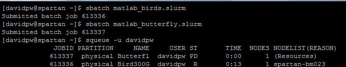</center>

***

### Useful Auxiliary Commands

Now that we know how to submit jobs to Spartan either through `sinteractive` or `sbatch`, lets look at some other useful commands in Spartan. Spartan uses a Unix-based operating system so a lot of Unix xommands work here. These commands range from help functions, in built text-editors, checking job status, or job control. Some of these may have been used earlier in this document but are important enough for another mention:

*  `man <function name>`: This is Spartan's help function. For example, `man Spartan` will call the Spartan FAQ, `man sbatch` will call the help file for the `sbatch` command, and `man R` will call the help file for running R in Spartan.

***
<center>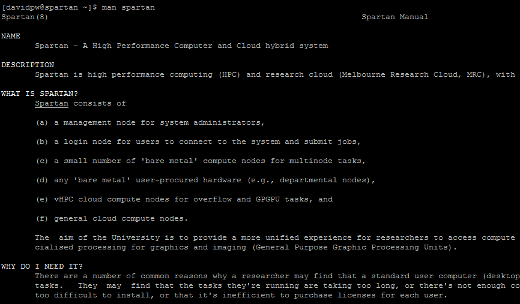</center>

***

*  `pwd`: Print working directory

*  `ls`: List all files/directories in current directory

*  `cd <file path>`: Change current directory. `cd` sets you to your home directory, `cd -` goes to previous directory, `cd ..` goes back one step towards root

*  `rm <filename>`: Delete a file

*  `mkdir <folder name>`: Create a new folder in current directory

*  `rmdir <folder name>`: Delete a folder (must be empty)

*  `nano <filename>`: This is Spartan's in-built text editor. This can be used for on the fly alterations to a file (i.e. increase memory limit), but I use it most often for reading the slurm output files for checking why a model run failed.

***
<center>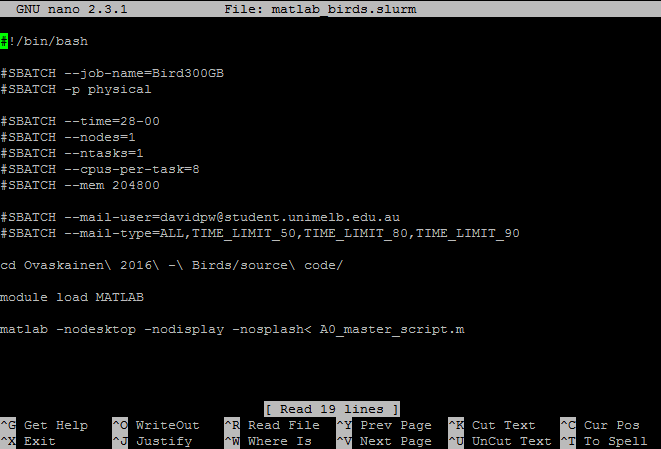</center>

***

*  `head <filename>` and `tail <filename>`: Print the first/last ten lines of a file

*  `history`: List commands you've used previously. You can navigate previous commands in your current session using the up/down keys like in `R`, but this lists previous commands over previous sessions as well

*  `echo <text>`: Prints text

*  `squeue`: This command is used for checking on job status.
    +  `squeue`: This base command will show all jobs in the queue for all users
    +  `squeue -u <username>`: This will show all jobs for a particular user
    +  `squeue -u <username> -t RUNNING`: This will show all running jobs for a particular user (can also use `PENDING`)

***
<center>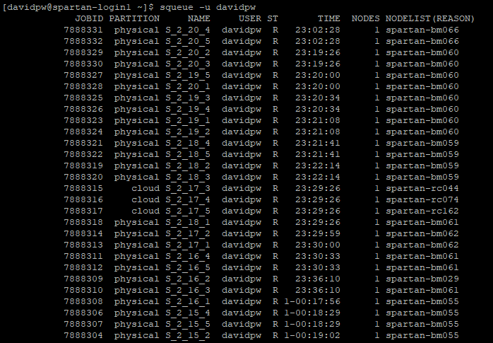</center>

***

*  `showq`: This command displays the *actual* queue and splits it into `ACTIVE`, `WAITING`, and `BLOCKED` jobs. `ACTIVE` jobs are those currently running. `WAITING` jobs are those "next in line" pending resource availability, and no user can have more than five jobs here. `BLOCKED` jobs are those in the queue but not in the "priority" `WAITING` area.
    + `showq`: This base command will show all jobs for all users in `ACTIVE` and `WAITING` but only a user's `BLOCKED` jobs
    + `showq -u <username>`: This will show all jobs for a particular user
    + `showq -p <partition>`: This will show all jobs running on a given partition, but more importantly provides more up to date information regarding the usage/availability of that partition than the Daily Weather Report
    
*  `scancel`: This command is used for cancelling jobs in the queue. For example:
    +  `scancel -u <username>`: cancels all jobs for that username
    +  `scancel -u <jobid>`: cancels the job called by <jobid>
    +  `scancel --name <JobName>`: cancels jobs by name
    +  `scancel -t PENDING -u <username>`: This cancels all pending jobs for a particular user

*  `sstat`: This command is used to show memory information of running jobs:
    +  For non-admin users there is no need to specify a username as you are restricted to your own jobs only by default
    +  You can use the `--format` option to specify the details you want to see. You can list multiple comma-separated fields to view more details
    +  `sstat --helpformat` will list the available fields to view
    +  Browsing `man sstat` will let you see descriptions for each field
    +  For example: `sstat -j <jobid> --format JobID,NTasks,Nodelist,MaxRSS,MaxVMSize,AveRSS,AveVMSize`

*  `sacct`: This command is used to show memory information of completed jobs:
    +  For non-admin users there is no need to specify a username as you are restricted to your own jobs only by default
    +  You can use the `--format` option to specify the details you want to see. You can list multiple comma-separated fields to view more details
    +  `sacct --helpformat` will list the available fields to view (many more options that `sstat`)
    +  Browsing `man sacct` will let you see descriptions for each field
    +  For example: `sacct -j <jobid> --format JobID,jobname,NTasks,nodelist,MaxRSS,MaxVMSize,AveRSS,AveVMSize,ExitCode,CPUTime`

## Additional information and links

*  There are simple example slurm files for the most common modules at `/usr/local/common/` (including R, MATLAB, and Python)
*  [Online Spartan FAQ](https://dashboard.hpc.unimelb.edu.au/spartan-faq). Same as using `man spartan`
*  [Online SLURM FAQ](http://www.ceci-hpc.be/slurm_faq.html)
*  [Online SLURM script generator](https://dashboard.hpc.unimelb.edu.au/guides/script_generator/). Simple jobs only though!
*  `srun` and `salloc` functions are used for parallel jobs
*  [Support for multi-core/multi-threaded architecture](https://slurm.schedmd.com/mc_support.html)
*  [Running R in parallel using the rslurm package](https://cran.r-project.org/web/packages/rslurm/vignettes/rslurm-vignette.html)

```{r eval=FALSE, echo=FALSE}
"GNU Terry Pratchett"
```

***
***

